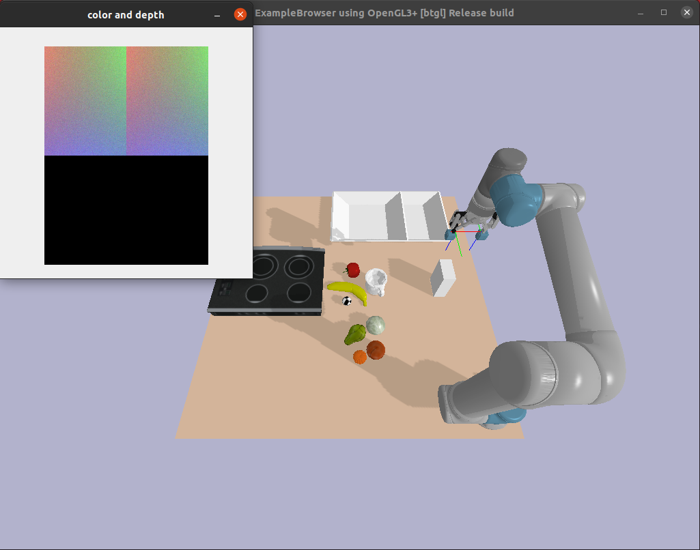

# TEST ENV

It generates a test enviroment in **Pybullet** using the robot UR5 to interact with different objects.
Once the script 'test_env.py' is executed the environment will appear.

To control the robot use the keyboard as follows:
| Key     |Action            |
|---------|------------------|
|H        | Close gripper    |
|Y        | Open gripper     |
|&uarr;   | Moving forward   |
|&darr;   | Moving backward  |
|&larr;   | Moving left      |
|&rarr;   | Moving right     |

Useful paths:
* Test environment path: rpn/rpn/test_env.py
* Objects URDF models path:  rpn/third_party/pybullet/utils/models
* Robot URD path: rpn/third_party/pybullet/utils/models/ur5/urdf/ur5_robotiq_85_digit.urdf
* Tactile sensor URDF path: rpn/third_party/pybullet/utils/models/ur5/meshes_digit/digit.urdf

Repositories:
* Tactile sensor <https://github.com/ElectronicElephant/pybullet_ur5_robotiq>
* URDF UR5 <https://github.com/ElectronicElephant/pybullet_ur5_robotiq> 